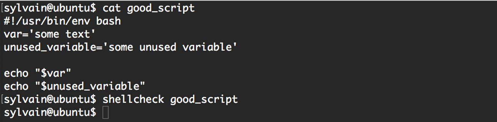
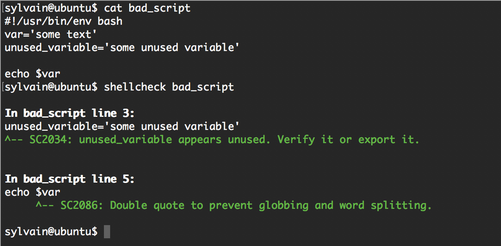

<table align="center">
  <tr>
    <td align="center">
      
       
    </td>
    <td align="center">
      
       
    </td>
  </tr>
  <tr>
    <td align="center">
      
       
    </td>
    <td align="center">
      
       
    </td>
  </tr>
</table>

# Project: Curriculum - SE Foundations - Loops, Conditions, and Parsing

## Table of Contents
1. [Description](#description)
2. [Background Context](#background-context)
3. [Learning Objectives](#learning-objectives)
4. [Requirements](#requirements)
5. [Tasks](#tasks)
   - [Task 0: Create a SSH RSA key pair](#task-0-create-a-ssh-rsa-key-pair)
   - [Task 1: For Best School loop](#task-1-for-best-school-loop)
   - [Task 2: While Best School loop](#task-2-while-best-school-loop)
   - [Task 3: Until Best School loop](#task-3-until-best-school-loop)
   - [Task 4: If 9, say Hi!](#task-4-if-9-say-hi)
   - [Task 5: 4 bad luck, 8 is your chance](#task-5-4-bad-luck-8-is-your-chance)
   - [Task 6: Superstitious numbers](#task-6-superstitious-numbers)
   - [Task 7: Clock](#task-7-clock)
   - [Task 8: For ls](#task-8-for-ls)
   - [Task 9: To file, or not to file](#task-9-to-file-or-not-to-file)
   - [Task 10: FizzBuzz](#task-10-fizzbuzz)
   - [Task 11: Read and cut (Advanced)](#task-11-read-and-cut-advanced)
   - [Task 12: Tell the story of passwd (Advanced)](#task-12-tell-the-story-of-passwd-advanced)
   - [Task 13: Let's parse Apache logs (Advanced)](#task-13-lets-parse-apache-logs-advanced)
   - [Task 14: Dig the data (Advanced)](#task-14-dig-the-data-advanced)
6. [Copyright](#copyright)

## Description

This project is part of the SE Foundations curriculum and focuses on the topics of loops, conditions, parsing, and working with Bash scripts. The tasks in this project will help me gain a better understanding of these fundamental concepts in software engineering and DevOps.

## Background Context

In this section, you will find information about the project's context and resources related to the tasks.

- The project highlights the transition to using Discord as the communication platform.
- It provides links to resources and references to help you complete the tasks effectively.
- You will also find information about Shellcheck, a tool for writing proper Bash scripts, which you should use to ensure your scripts meet the required standards.

## Learning Objectives

By the end of this project, you are expected to achieve the following learning objectives:

- Create SSH keys for secure authentication.
- Understand the advantages of using `#!/usr/bin/env bash` over `#!/bin/bash`.
- Utilize various types of loops, including `for`, `while`, and `until`.
- Implement conditional statements such as `if`, `else`, `elif`, and `case`.
- Work with file comparison operators.
- Write Bash scripts that meet specific requirements and standards.

## Requirements

### General

- Allowed editors: vi, vim, emacs.
- All your files will be interpreted on Ubuntu 20.04 LTS.
- All your files should end with a new line.
- A README.md file, at the root of the project folder, is mandatory.
- All your Bash script files must be executable.
- You are not allowed to use `awk`.
- Your Bash script must pass Shellcheck (version 0.7.0) without any errors.
- The first line of all your Bash scripts should be `#!/usr/bin/env bash`.
- The second line of all your Bash scripts should be a comment explaining what the script is doing.

### Copyright - Plagiarism

- You are required to come up with your solutions for the tasks; copying and pasting someone else's work is not allowed.
- You are not allowed to publish any content of this project.
- Any form of plagiarism is strictly forbidden and will result in removal from the program.

## Tasks

### Task 0: Create a SSH RSA key pair
#### Score: 65.0%

- Create an RSA key pair and share your public key (`0-RSA_public_key.pub`).
- Fill the SSH public key field of your intranet profile with the public key you generated.
- Safely store the private key for later use.
- If you add a passphrase to your key, save it securely.

### Task 1: For Best School loop
#### Score: 65.0%

- Write a Bash script that displays "Best School" 10 times.
- Use the `for` loop for this task.

### Task 2: While Best School loop
#### Score: 65.0%

- Write a Bash script that displays "Best School" 10 times.
- Use the `while` loop for this task.

### Task 3: Until Best School loop
#### Score: 65.0%

- Write a Bash script that displays "Best School" 10 times.
- Use the `until` loop for this task.

### Task 4: If 9, say Hi!
#### Score: 65.0%

- Write a Bash script that displays "Best School" 10 times.
- For the 9th iteration, display "Hi" on a new line.
- Use the `while` loop and the `if` statement.

### Task 5: 4 bad luck, 8 is your chance
#### Score: 65.0%

- Write a Bash script that loops from 1 to 10.
- Display "bad luck" for the 4th loop iteration.
- Display "good luck" for the 8th loop iteration.
- Display "Best School" for other iterations.
- Use the `while` loop and the `if`, `elif`, and `else` statements.

### Task 6: Superstitious numbers
#### Score: 65.0%

- Write a Bash script that displays numbers from 1 to 20.
- Display "bad luck from China" for the 4th loop iteration.
- Display "bad luck from Japan" for the 9th loop iteration.
- Display "bad luck from Italy" for the 17th loop iteration.
- Use the `while` loop and the `case` statement.

### Task 7: Clock
#### Score: 65.0%

- Write a Bash script that displays the time for 12 hours and 59 minutes.
- Display hours from 0 to 12.
- Display minutes from 1 to 59.
- Use the `while` loop.

### Task 8: For ls
#### Score: 65.0%

- Write a Bash script that displays the content of the current directory.
- Display in a list format.
- Show only the part of the name after the first dash.
- Use the `for` loop and do not display hidden files.

### Task 9: To file, or not to file
#### Score: 65.0%

- Write a Bash script that provides information about a file named "school."
- Check if the file exists.
- Display "school is a file" if it exists.
- Display "school does not exist" if it does not.
- Use the `if` statement.

### Task 10: FizzBuzz
#### Score: 65.0%

- Write a Bash script that prints the numbers from 1 to 100.
- For multiples of three, print "Fizz" instead of the number.
- For multiples of five, print "Buzz" instead of the number.
- For numbers that are multiples of both three and five, print "FizzBuzz."
- Use the `for` loop and the `if` statement.

### Task 11: Read and cut (Advanced)
#### Score: 80.0%

- Write a Bash script that takes a text file as input.
- Read and display the content of the input file.
- Use the `cut` command to display only the first 10 lines.

### Task 12: Tell the story of passwd (Advanced)
#### Score: 80.0%

- Write a Bash script that provides information about the `/etc/passwd` file.
- Display "The `/etc/passwd` file is a common file used to store user information" if it exists.
- Display "The `/etc/passwd` file does not exist" if it does not.
- Use the `if` statement.

### Task 13: Let's parse Apache logs (Advanced)
#### Score: 80.0%

- Write a Bash script that parses Apache logs to count the number of requests from an IP address.
- Read an Apache log file and display the count of requests from the IP address provided as an argument.
- Use the `awk` command.

### Task 14: Dig the data (Advanced)
#### Score: 80.0%

- Write a Bash script that queries a DNS server for the IP address of a given domain name.
- Take the domain name as an argument.
- Use the `dig` command to perform the DNS query.

## Copyright

© 2023 ALX School All Rights Reserved.
