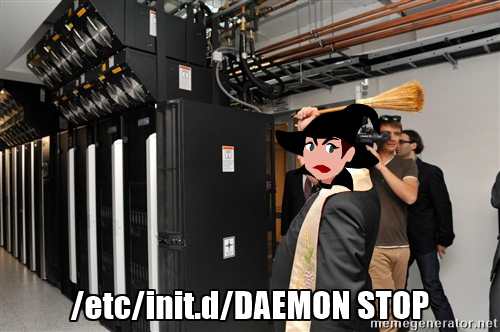

<table align="center">
  <tr>
    <td align="center">
      
       
    </td>
    <td align="center">
      
       
    </td>
  </tr>
  <tr>
    <td align="center">
      
       
    </td>
    <td align="center">
      
       
    </td>
  </tr>
</table>

# Project: 0x05. Processes and Signals
## By [ifeanyi kalu](https://github.com/fazzy12)

This project involved working with processes and signals in a Linux environment. Below, you'll find an overview of the tasks completed, what was learned, and the resources that helped during the project.

## Project Overview

- **Duration**: October 14, 2022, 6:00 AM - October 15, 2022, 6:00 AM
- **Auto QA Review**: 10.0/26 mandatory & 6.0/17 optional
- **Overall Score**: 52.03%
  - Mandatory: 38.46%
  - Optional: 35.29%
- **Auto-corrected with**: Ubuntu 20.04 LTS

## What Was Achieved

### Tasks Completed

1. **What is my PID**: A Bash script was created to display its own PID.

2. **List your processes**: A Bash script was created to display a list of currently running processes, showing all processes, including those without a TTY, in a user-oriented format with process hierarchy.

3. **Show your Bash PID**: A Bash script was created to display lines containing the word "bash," allowing you to easily get the PID of your Bash process.

4. **Show your Bash PID made easy**: Another Bash script was created to display the PID, along with the process name, of processes containing the word "bash."

5. **To infinity and beyond**: A Bash script was written to display "To infinity and beyond" indefinitely with a 2-second pause between each iteration.

6. **Don't stop me now!**: A Bash script was supposed to stop the "To infinity and beyond" process.

7. **Stop me if you can**: Another script was expected to stop the "To infinity and beyond" process without using the `kill` command.

8. **Highlander**: A Bash script was created to display "To infinity and beyond" with a 2-second pause between each iteration, displaying "I am invincible!!!" when receiving a SIGTERM signal. A separate script was created to kill this process.

9. **Beheaded process**: A script was created to kill the "Highlander" process.

10. **Process and PID file**: A Bash script was written to create a PID file, display messages, and respond to various signals by deleting the PID file and terminating itself.

11. **Manage my process**: A Bash script called `manage_my_process` was created to manage another script called `manage_my_process`. It could start, stop, or restart the process and maintain a PID file.

12. **Zombie**: A C program was written to create 5 zombie processes, each displaying "Zombie process created, PID: ZOMBIE_PID."

### Learning Objectives

By completing these tasks, the following learning objectives were met:

- Understanding what a PID (Process ID) is.
- Knowledge of processes and how to list them.
- Familiarity with managing processes in a Linux environment.
- Understanding signals and how to handle them.
- Creating and managing PID files.

### Resources Used

- **[Linux PID](https://intranet.alxswe.com/rltoken/qVGxUt1QMIV4B4oVrQBlQg)**: Online resources explaining the concept of Process IDs (PIDs) in Linux.
- **[Linux process](https://intranet.alxswe.com/rltoken/px2TdWSjVO8i9SB5gHchAw)**: Documentation and articles about processes in Linux.
- **[Linux signal](https://intranet.alxswe.com/rltoken/qQSGz9CN52PVF3IPCuaRiw)**: Information on signals in Linux.
- **[Process management in Linux](https://intranet.alxswe.com/rltoken/XlYrlghzNZ6Z1cbI_IPaiA)**: Guides on managing processes in Linux.
- **man pages**: References to man pages for commands like `ps`, `pgrep`, `pkill`, `kill`, `exit`, `trap`, etc.

These resources were essential for understanding the concepts and commands used in the project.

This README provides an overview of the project, the tasks accomplished, and the knowledge gained. Each completed task corresponds to a specific script or program. You can refer to the specific script files in the project directory for more detailed information about each task's implementation.

Feel free to reach out for further details or clarifications.
