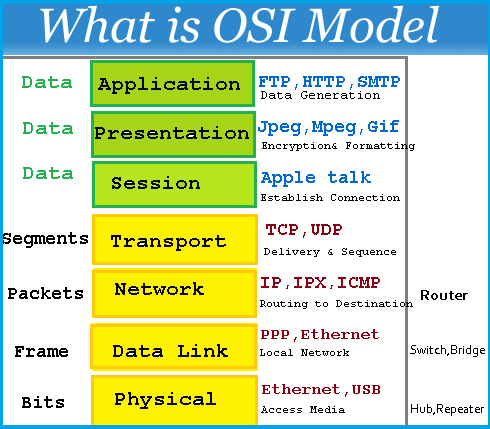
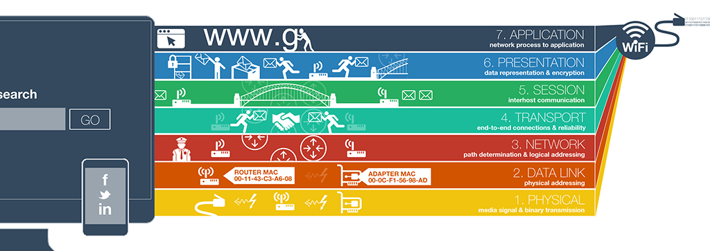

<table align="center">
  <tr>
    <td align="center">
      
      <br/>
    </td>
    <td align="center">
      
      <br/>
    </td>
  </tr>
  <tr>
    <td align="center">
      
      <br/>
    </td>
    <td align="center">
      
      <br/>
    </td>
  </tr>
  <tr>
    <td colspan="2" align="center">
      
      <br/>
    </td>
  </tr>
</table>


# Networking Basics #0

This project is part of the ALX School curriculum and focuses on understanding fundamental networking concepts and protocols. By completing this project, you will gain knowledge about the OSI model, types of networks, MAC and IP addresses, TCP/UDP protocols, and network troubleshooting using ICMP.

## Learning Objectives

After completing this project, you should be able to:

- Explain the OSI Model, its purpose, and its organization into layers.
- Differentiate between LAN (Local Area Network) and WAN (Wide Area Network).
- Understand the role of the Internet in networking.
- Define IP addresses and distinguish between IPv4 and IPv6.
- Comprehend the concept of localhost and subnets.
- Recognize the differences between TCP (Transmission Control Protocol) and UDP (User Datagram Protocol).
- Identify common TCP/UDP port numbers.
- Troubleshoot network connectivity using ICMP (Internet Control Message Protocol).

## Resources

To successfully complete this project, you can refer to the following resources:

- [OSI model](https://en.wikipedia.org/wiki/OSI_model)
- [Different types of networks](https://www.lifewire.com/lans-wans-and-other-area-networks-817376)
- [LAN vs. WAN](https://www.geeksforgeeks.org/difference-between-lan-wan-and-man/)
- [MAC address](https://en.wikipedia.org/wiki/MAC_address)
- [What is an IP address](https://www.networkworld.com/article/3236064/what-is-ip-address.html)
- [IPv4 vs. IPv6](https://www.differencebetween.com/difference-between-ipv4-and-ipv6/)
- [TCP and UDP](https://www.homenethowto.com/how-tos/pc-apps/how-to-use-tcp-and-udp-ports/)
- [TCP/UDP ports](https://en.wikipedia.org/wiki/List_of_TCP_and_UDP_port_numbers)
- [ICMP](https://en.wikipedia.org/wiki/Internet_Control_Message_Protocol)
- [LAN network](https://en.wikipedia.org/wiki/Local_area_network)
- [WAN network](https://en.wikipedia.org/wiki/Local_area_networkhttps://en.wikipedia.org/wiki/Local_area_network)
- [Internet](https://en.wikipedia.org/wiki/Internet)
- [MAC address](https://en.wikipedia.org/wiki/mac_address)
- [What is an IP address](https://www.bleepingcomputer.com/tutorials/ip-addresses-explained/)
- [Private and public address](https://www.iplocation.net/public-vs-private-ip-address)
- [IPv4 and IPv6](https://www.webopedia.com/insights/ipv6-ipv4-difference/)
- [Localhost](https://en.wikipedia.org/wiki/Localhost)
- [TCP and UDP](https://www.howtogeek.com/190014/htg-explains-what-is-the-difference-between-tcp-and-udp/)
- [TCP/UDP ports List](https://en.wikipedia.org/wiki/List_of_TCP_and_UDP_port_numbers)
- [What is ping /ICMP](https://en.wikipedia.org/wiki/Ping_%28networking_utility%29)
- [Positional parameters](https://www.adminschoice.com/bash-positional-parameters)

## Project Structure

This project is organized into tasks, each addressing specific networking concepts. The tasks are as follows:

1. **OSI model:** Understand the OSI model's purpose and organization.

2. **Types of network:** Differentiate between LAN, WAN, and the Internet.

3. **MAC and IP address:** Define MAC and IP addresses.

4. **TCP and UDP:** Learn about TCP and UDP protocols and their differences.

5. **TCP and UDP ports:** Identify common TCP/UDP port numbers.

6. **Is the host on the network:** Create a Bash script to ping an IP address.

## Getting Started

To work on this project, follow these steps:

1. Clone this repository to your local machine.

```
   git clone https://github.com/your-usernam alx-system_engineering-devops.git
```

2. Navigate to the project directory for Networking Basics #0.

```
cd alx-system_engineering-devops/0x07-networking_basics
```
3. Complete each task according to the instructions provided.


4. To execute the Bash scripts for various tasks, make sure they are executable and use the appropriate arguments as specified in the task instructions.

Example:
```
    ./5-is_the_host_on_the_network 8.8.8.8
```