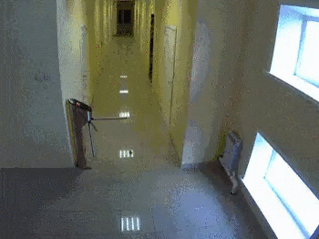

# Project Title

<div style="display: flex; justify-content: space-between;">


</div>

## Description

This project demonstrates the configuration of port forwarding on the web server (web-01) using the UFW (Uncomplicated Firewall) tool. The goal is to redirect incoming traffic from port 8080/TCP to port 80/TCP.

## Table of Contents

- [Installation](#installation)
- [Usage](#usage)
- [Configuration](#configuration)
- [Contributing](#contributing)

## Installation

1. **Clone the repository:**

   ```
   git clone https://github.com//home/fazzy/alx-system_engineering-devops/0x13-firewall
    ```

2. **Navigate to the project directory:**

    ```
    cd your-repo
    ```

3. **Review and execute the UFW configuration script:**

    ```
    # Example command
    sudo ufw route allow 8080 comment 'HTTP'
    ```
## Usage

To integrate the port forwarding configuration into your web server environment, follow these steps:

1. **Clone the repository:**

   ```
   git clone https:///home/fazzy/alx-system_engineering-devops/0x13-firewall
   ```
2. **Navigate to the project directory:**

    ```
    cd your-repo
    ```
3. **Review and execute the UFW configuration script:**

    ```
    # Example command
    sudo ufw route allow 8080 comment 'HTTP'
    ```

## Contributing
If you would like to contribute to the project, follow these steps:

1. Fork the repository.
2. Create a new branch for your feature or bug fix.
3. Make changes and commit them.
4. Push your changes to your fork.
5. Submit a pull request to the main repository.
